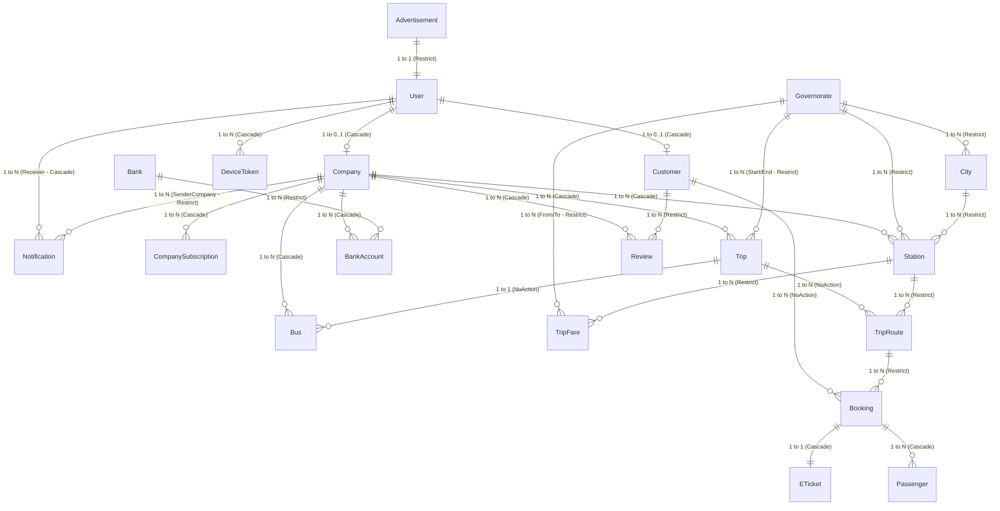

# توثيق هيكلية قاعدة بيانات نظام درب (Darb System DB Schema)

يحتوي هذا الملف على توثيق شامل وتفصيلي لهيكلية قاعدة البيانات لنظام **درب (Darb System)** لإدارة رحلات وحجوزات النقل البري الجماعي. تم تصميم الهيكلية لتكون متكاملة تدعم تعدد المستأجرين (Multi-Tenancy) للشركات الناقلة، بالإضافة إلى التحكم بالصلاحيات والأمان وربط المحطات والخطوط والرحلات بشكل مرن.

---

## 📊 مخطط العلاقات بين الكيانات (Entity-Relationship Diagram - ERD)



---

## 🗂️ تفاصيل الجداول والموديلات (Detailed Models & Tables)

تم تقسيم الجداول بناءً على الوظيفة والأهمية إلى 5 مجموعات رئيسية:
1. **إدارة الحسابات والمستخدمين (Identity & Authentication)**
2. **إدارة الشركات والاشتراكات (Company & Subscription)**
3. **الجغرافيا والمحطات (Geography & Stations)**
4. **إدارة الحافلات والرحلات والمسارات (Buses, Trips & Routes)**
5. **إدارة الحجوزات، التذاكر، والركاب (Bookings, Tickets & Passengers)**
6. **التقييمات، الإشعارات، والإعلانات (Reviews, Notifications & Ads)**

---

### 1. إدارة الحسابات والمستخدمين (Identity & Authentication)

#### 👥 جدول المستخدمين `Users` (C# Class: `User`)
يمثل الكيان الأساسي للمصادقة وتحديد الهوية في النظام لجميع الفئات (المسؤولين، الشركات، والعملاء).
* **اسم الكلاس:** `User.cs`

| اسم الحقل (Property) | نوع البيانات (SQL/C#) | القيود والشروط (Constraints) | الوصف والشرح |
| :--- | :--- | :--- | :--- |
| `UserId` | `int` | `PK`, `Identity` | المعرف الفريد للمستخدم. |
| `Email` | `string?` | `Unique`, `Nullable` | البريد الإلكتروني للمستخدم (فريد لتجنب التكرار). |
| `Password` | `string` | `Required`, `MaxLength(100)` | كلمة المرور المشفرة. |
| `Role` | `AccountRoles` (Enum) | `Required`, `Converted to String` | دور المستخدم في النظام (`Admin`, `Company`, `Customer`). |
| `IsActive` | `bool` | `Required`, `Default: false` | حالة الحساب (مفعل أم معطل). |
| `JoinDate` | `DateTime` | `Required`, `Default: UtcNow` | تاريخ انضمام المستخدم للنظام. |

* **العلاقات (Relationships):**
  - **مستخدم 🔁 عميل (`Customer`):** علاقة رأس برأس (One-to-One). حذف المستخدم يؤدي لحذف ملف العميل تلقائياً (`Cascade`).
  - **مستخدم 🔁 شركة (`Company`):** علاقة رأس برأس (One-to-One). حذف المستخدم يؤدي لحذف ملف الشركة تلقائياً (`Cascade`).
  - **مستخدم 🔁 إشعارات (`Notification`):** علاقة رأس بأطراف (One-to-Many).
  - **مستخدم 🔁 رموز الأجهزة (`DeviceToken`):** علاقة رأس بأطراف (One-to-Many).

---

#### 👨‍💼 جدول العملاء `Customers` (C# Class: `Customer`)
يحتوي على البيانات التفصيلية للعملاء/المسافرين الذين يملكون حسابات مسجلة في النظام للقيام بالحجوزات.
* **اسم الكلاس:** `Customer.cs`

| اسم الحقل (Property) | نوع البيانات (SQL/C#) | القيود والشروط (Constraints) | الوصف والشرح |
| :--- | :--- | :--- | :--- |
| `CustomerId` | `int` | `PK`, `Identity` | المعرف الفريد للعميل. |
| `FullName` | `string` | `Required`, `MaxLength(255)` | الاسم الكامل للعميل. |
| `DateOfBirth` | `DateTime` | `Required`, `ColumnType: date` | تاريخ الميلاد (بدون الوقت). |
| `Phone` | `string` | `Required`, `Unique`, `Phone` | رقم الهاتف المحمول (فريد للتواصل والمصادقة). |
| `Address` | `string` | `Required`, `MaxLength(255)` | عنوان العميل الحالي. |
| `NationalId` | `string` | `Required`, `MaxLength(11)` | رقم الهوية الوطنية/الجواز للعميل. |
| `UserId` | `int` | `FK` -> `Users.UserId` | مفتاح أجنبي يشير إلى حساب المستخدم الأساسي. |

* **العلاقات (Relationships):**
  - **عميل 🔁 مستخدم (`User`):** علاقة رأس برأس عكسية.
  - **عميل 🔁 حجوزات (`Booking`):** علاقة رأس بأطراف (One-to-Many) مع إيقاف الحذف المتتالي (`NoAction`) لتفادي فقدان بيانات الحجوزات التاريخية.
  - **عميل 🔁 تقييمات (`Review`):** علاقة رأس بأطراف (One-to-Many) مع خاصية الحظر عند الحذف (`Restrict`).

---

### 2. إدارة الشركات والاشتراكات (Company & Subscription)

#### 🏢 جدول الشركات `Companies` (C# Class: `Company`)
يمثل شركات النقل البري الجماعي المشتركة في النظام والتي تدير رحلاتها وحافلاتها الخاصة.
* **اسم الكلاس:** `Company.cs`

| اسم الحقل (Property) | نوع البيانات (SQL/C#) | القيود والشروط (Constraints) | الوصف والشرح |
| :--- | :--- | :--- | :--- |
| `CompanyId` | `int` | `PK`, `Identity` | المعرف الفريد للشركة. |
| `Name` | `string` | `Required`, `Unique`, `MaxLength(150)` | اسم شركة النقل البري (فريد للتميز). |
| `Address` | `string` | `Required`, `MaxLength(255)` | العنوان الرئيسي لمقر الشركة. |
| `Logo` | `string` | `Required` | رابط أو مسار صورة شعار الشركة. |
| `License` | `string` | `Required` | مستند أو مسار ترخيص مزاولة المهنة للشركة للتحقق. |
| `AverageRating` | `double` | `Required`, `Default: 0.0` | متوسط التقييمات الإجمالي للشركة بناءً على مراجعات العملاء. |
| `UserId` | `int` | `FK` -> `Users.UserId` | مفتاح أجنبي يربط الشركة بحساب مستخدم مسجل في النظام. |

* **العلاقات (Relationships):**
  - **شركة 🔁 مستخدم (`User`):** علاقة رأس برأس.
  - **شركة 🔁 حافلات (`Bus`):** علاقة رأس بأطراف (One-to-Many) مع حذف متتالي (`Cascade`).
  - **شركة 🔁 رحلات (`Trip`):** علاقة رأس بأطراف (One-to-Many) مع حذف متتالي (`Cascade`).
  - **شركة 🔁 اشتراكات (`CompanySubscription`):** علاقة رأس بأطراف (One-to-Many) لتتبع فواتير واشتراكات الشركة.
  - **شركة 🔁 محطات (`Station`):** علاقة رأس بأطراف (One-to-Many) للمحطات المملوكة أو المدارة من قبل الشركة.
  - **شركة 🔁 حسابات بنكية (`BankAccount`):** علاقة رأس بأطراف (One-to-Many).
  - **شركة 🔁 تقييمات (`Review`):** علاقة رأس بأطراف (One-to-Many).

---

#### 💳 جدول اشتراكات الشركات `CompanySubscription` (C# Class: `CompanySubscription`)
يدير العمليات المالية وسجل الاشتراكات الخاصة بشركات النقل للوصول لخدمات النظام.
* **اسم الكلاس:** `CompanySubscription.cs`

| اسم الحقل (Property) | نوع البيانات (SQL/C#) | القيود والشروط (Constraints) | الوصف والشرح |
| :--- | :--- | :--- | :--- |
| `CompanySubscriptionId` | `int` | `PK`, `Identity` | المعرف الفريد للاشتراك. |
| `PlanType` | `SubscriptionPlans` (Enum)| `Required`, `Converted to String` | نوع باقة الاشتراك (`Monthly`, `Yearly`). |
| `SubscriptionDate` | `DateTime` | `Required` | تاريخ بدء تفعيل الاشتراك الحالي. |
| `ExpiryDate` | `DateTime` | `Required` | تاريخ انتهاء صلاحية الاشتراك. |
| `PaymentSlip` | `string` | `Required` | مسار صورة سند الدفع أو إيصال التحويل المالي. |
| `Status` | `SubscriptionStatus` (Enum)| `Required`, `Default: Pending` | حالة الطلب (`Pending`, `Approved`, `Rejected`). |
| `RequestType` | `RequestType` (Enum) | `Required` | نوع الطلب (`NewRegistration` تسجيل جديد، `Renewal` تجديد). |
| `CompanyId` | `int` | `FK` -> `Companies.CompanyId` | الشركة صاحبة هذا الاشتراك. |

---

### 3. الجغرافيا والمحطات (Geography & Stations)

#### 🗺️ جدول المحافظات `Governorates` (C# Class: `Governorate`)
يمثل الكيان الجغرافي الأساسي (المحافظات) لتنظيم خطوط سير الرحلات والمحطات.
* **اسم الكلاس:** `Governorate.cs`

| اسم الحقل (Property) | نوع البيانات (SQL/C#) | القيود والشروط (Constraints) | الوصف والشرح |
| :--- | :--- | :--- | :--- |
| `GovernorateId` | `int` | `PK`, `Identity` | المعرف الفريد للمحافظة. |
| `Name` | `string?` | `Required` | اسم المحافظة (مثال: صنعاء، عدن، تعز). |

---

#### 🏙️ جدول المدن `Cities` (C# Class: `City`)
المدن التابعة للمحافظات، لتفصيل أدق للمواقع.
* **اسم الكلاس:** `City.cs`

| اسم الحقل (Property) | نوع البيانات (SQL/C#) | القيود والشروط (Constraints) | الوصف والشرح |
| :--- | :--- | :--- | :--- |
| `CityId` | `int` | `PK`, `Identity` | المعرف الفريد للمدينة. |
| `Name` | `string` | `Required` | اسم المدينة داخل المحافظة. |
| `GovernorateId` | `int` | `FK` -> `Governorates.GovernorateId` | المحافظة التابعة لها هذه المدينة. |

* **العلاقات (Relationships):**
  - **محافظة 🔁 مدن:** علاقة رأس بأطراف (`Restrict` عند حذف المحافظة في حال وجود مدن مرتبطة بها).

---

#### 📍 جدول المحطات `Stations` (C# Class: `Station`)
مراكز تجمع الحافلات والانطلاق والتوقف التابعة للشركات الناقلة.
* **اسم الكلاس:** `Station.cs`

| اسم الحقل (Property) | نوع البيانات (SQL/C#) | القيود والشروط (Constraints) | الوصف والشرح |
| :--- | :--- | :--- | :--- |
| `StationId` | `int` | `PK`, `Identity` | المعرف الفريد للمحطة. |
| `Address` | `string?` | `Required`, `MaxLength(250)` | العنوان التفصيلي للمحطة أو الوصف المكاني. |
| `CityId` | `int` | `FK` -> `Cities.CityId` | المدينة التي تتواجد بها المحطة. |
| `GovernorateId` | `int` | `FK` -> `Governorates.GovernorateId` | المحافظة التي تتواجد بها المحطة. |
| `CompanyId` | `int` | `FK` -> `Companies.CompanyId` | الشركة الناقلة المالكة أو التي تدير المحطة. |

* **العلاقات (Relationships):**
  - الحذف للمحافظة مرتبط بالمحطة بقيد الحظر `DeleteBehavior.Restrict` لمنع حذف محافظة تحتوي على محطات نشطة.
  - الحذف للشركة مرتبط بالمحطة بقيد الحذف المتتالي `DeleteBehavior.Cascade` (إذا حذفت الشركة تُحذف محطاتها).

---

### 4. إدارة الحافلات والرحلات والمسارات (Buses, Trips & Routes)

#### 🚌 جدول الحافلات `Buses` (C# Class: `Bus`)
أسطول النقل الخاص بالشركات والذي يتم تخصيصه للرحلات.
* **اسم الكلاس:** `Bus.cs`

| اسم الحقل (Property) | نوع البيانات (SQL/C#) | القيود والشروط (Constraints) | الوصف والشرح |
| :--- | :--- | :--- | :--- |
| `BusId` | `int` | `PK`, `Identity` | المعرف الفريد للحافلة. |
| `PlateNumber` | `string?` | `Required` | رقم اللوحة المعدنية للحافلة (للتعريف القانوني والأمني). |
| `BusStatus` | `BusStatus` (Enum) | `Required` | حالة الحافلة في الخدمة (`Available` متاحة، `UnderMaintenance` صيانة). |
| `Model` | `string?` | `Required` | موديل أو صانع الحافلة (مثل: Mercedes, Volvo). |
| `BusCapacity` | `int` | `Required` | السعة الإجمالية لعدد المقاعد المتاحة بالباص. |
| `CompanyId` | `int` | `FK` -> `Companies.CompanyId` | الشركة المالكة للباص. |

---

#### 🗺️ جدول الرحلات `Trips` (C# Class: `Trip`)
يمثل الرحلات المجدولة بواسطة الشركات للانتقال بين المحافظات.
* **اسم الكلاس:** `Trip.cs`

| اسم الحقل (Property) | نوع البيانات (SQL/C#) | القيود والشروط (Constraints) | الوصف والشرح |
| :--- | :--- | :--- | :--- |
| `TripId` | `int` | `PK`, `Identity` | المعرف الفريد للرحلة. |
| `StartGoveId` | `int` | `FK` -> `Governorates.Id` | محافظة الانطلاق للرحلة (`Restrict` عند الحذف). |
| `EndGoveId` | `int` | `FK` -> `Governorates.Id` | محافظة الوصول للرحلة (`Restrict` عند الحذف). |
| `AvailableSeats` | `int` | `Required` | عدد المقاعد الشاغرة حالياً في الرحلة. |
| `Price` | `decimal` | `Required` | السعر الأساسي لتذكرة الرحلة بالكامل. |
| `DepDate` | `DateTime` | `Required` | تاريخ ووقت المغادرة الفعلي للرحلة. |
| `Period` | `Periods` (Enum) | `Required` | الفترة الزمنية للرحلة (`Day` رحلة نهارية، `Night` رحلة مسائية). |
| `TripStatus` | `TripStatus` (Enum) | `Required`, `Default: scheduled` | حالة الرحلة الحالية (`scheduled`, `cancelled`, `completed`, `Fulled`). |
| `CompanyId` | `int` | `FK` -> `Companies.CompanyId` | الشركة المنظمة والمشرفة على الرحلة (`Cascade`). |
| `BusId` | `int` | `FK` -> `Buses.BusId` | الحافلة المخصصة للرحلة (`NoAction` لحل التعارض الدائري). |

---

#### 🛤️ جدول محطات مسار الرحلة `TripRoutes` (C# Class: `TripRoute`)
*ملاحظة: هذا الجدول معرف في الكود بملف اسمه `TripSchedule.cs`.*
يمثل مسار الرحلة التفصيلي والمحطات الوسيطة التي ستمر بها الحافلة أثناء سيرها، مع توقيت المغادرة وسعر المقعد الخاص بكل محطة جزئية.

| اسم الحقل (Property) | نوع البيانات (SQL/C#) | القيود والشروط (Constraints) | الوصف والشرح |
| :--- | :--- | :--- | :--- |
| `TripRouteId` | `int` | `PK`, `Identity` | المعرف الفريد لمحطة المسار. |
| `TripId` | `int` | `FK` -> `Trips.TripId` | الرحلة المرتبطة بهذا المسار (`NoAction` لمنع التعارض). |
| `StationId` | `int` | `FK` -> `Stations.StationId` | المحطة المرتبطة بهذا التوقف الوسيط (`Restrict`). |
| `DepartureTime` | `TimeOnly` | `Required` | وقت المغادرة الدقيق من هذه المحطة. |
| `SeatFare` | `decimal` | `Required`, `decimal(18, 2)` | تسعيرة المقعد من المحطة الحالية إلى محطة الوصول. |

---

#### 💰 جدول أسعار تعرفة الرحلات `TripFares` (C# Class: `TripFare`)
جدول الإدارة لتسعير الرحلات بين المحافظات والمحطات بناءً على توجهات الشركة.
* **اسم الكلاس:** `TripFare.cs`

| اسم الحقل (Property) | نوع البيانات (SQL/C#) | القيود والشروط (Constraints) | الوصف والشرح |
| :--- | :--- | :--- | :--- |
| `TripFareId` | `int` | `PK`, `Identity` | المعرف الفريد للتعرفة. |
| `CompanyId` | `int` | `FK` -> `Companies.CompanyId` | الشركة صاحبة التعرفة (`Restrict`). |
| `FromGovId` | `int` | `FK` -> `Governorates.Id` | محافظة المغادرة للتعرفة (`Restrict`). |
| `ToGovId` | `int` | `FK` -> `Governorates.Id` | محافظة الوصول للتعرفة (`Restrict`). |
| `StationId` | `int` | `FK` -> `Stations.StationId` | المحطة المرتبطة بهذه التسعيرة (`Restrict`). |
| `Price` | `decimal` | `Required`, `decimal(18,2)` | القيمة المالية للتذكرة وفق هذه التوليفة. |
| `IsMainStation` | `bool` | `Required`, `Default: false` | هل هذه هي المحطة الرئيسية لانطلاق التسعيرة؟ |

---

### 5. إدارة الحجوزات، التذاكر، والركاب (Bookings, Tickets & Passengers)

#### 📝 جدول الحجوزات `Bookings` (C# Class: `Booking`)
يدير عمليات الحجز المؤقتة والمؤكدة التي يقوم بها العملاء.
* **اسم الكلاس:** `Booking.cs`

| اسم الحقل (Property) | نوع البيانات (SQL/C#) | القيود والشروط (Constraints) | الوصف والشرح |
| :--- | :--- | :--- | :--- |
| `BookingId` | `int` | `PK`, `Identity` | المعرف الفريد لعملية الحجز. |
| `CustomerId` | `int` | `FK` -> `Customers.CustomerId` | العميل الذي قام بالحجز (`NoAction` لمنع الفقد الدائري). |
| `TripRouteId` | `int` | `FK` -> `TripRoutes.TripRouteId` | المحطة والمسار المحدد الذي تم حجز الرحلة عليه (`Restrict`). |
| `ReservedSeatsCount` | `int` | `Required` | عدد المقاعد المحجوزة في هذه العملية. |
| `TotalAmount` | `decimal` | `Required` | التكلفة المالية الإجمالية المدفوعة للحجز. |
| `ReceiptImagePath` | `string?` | `Nullable` | مسار صورة سند الدفع للتحقق اليدوي من الإيداع المالي للشركة. |
| `Status` | `BookingStatus` (Enum) | `Required` | حالة الحجز الحالية (`PendingAttachment`, `AwaitingConfirmation`, `Confirmed`, `Cancelled`, `Completed`). |
| `BookingAt` | `DateTime` | `Required` | تاريخ ووقت تنفيذ عملية الحجز. |

---

#### 🎫 جدول التذاكر الإلكترونية `ETickets` (C# Class: `ETicket`)
التذكرة النهائية الصادرة بعد تأكيد الحجز، وتحتوي على رمز الاستجابة السريعة (QR) أو الكود للتحقق عند ركوب الباص.
* **اسم الكلاس:** `ETicket.cs`

| اسم الحقل (Property) | نوع البيانات (SQL/C#) | القيود والشروط (Constraints) | الوصف والشرح |
| :--- | :--- | :--- | :--- |
| `Id` | `int` | `PK`, `Identity` | المعرف الفريد للتذكرة الإلكترونية. |
| `BookingId` | `int` | `FK` -> `Bookings.BookingId` | معرّف الحجز المرتبط بهذه التذكرة (علاقة رأس برأس `1:1` - `Cascade`). |
| `TicketCode` | `string?` | `Nullable` | الرمز الفريد للتذكرة أو كود الـ QR للتحقق السريع. |
| `Status` | `ETicketStatus` (Enum)| `Required`, `Default: UnValid` | حالة التذكرة الإلكترونية (`UnValid` غير صالحة، `Valid` صالحة، `Expired` منتهية). |

---

#### 🧑‍بيانات الركاب المرافقين `Passenger` (C# Class: `Passenger`)
يسجل البيانات الرسمية للمسافرين الفعليين التابعين لحجز معين (قد يحجز شخص لعدة ركاب مرافقين له).
* **اسم الكلاس:** `Passenger.cs`

| اسم الحقل (Property) | نوع البيانات (SQL/C#) | القيود والشروط (Constraints) | الوصف والشرح |
| :--- | :--- | :--- | :--- |
| `PassengerId` | `int` | `PK`, `Identity` | المعرف الفريد للراكب. |
| `BookingId` | `int` | `FK` -> `Bookings.BookingId` | معرّف الحجز التابع له الركب (`Cascade` يحذف بحذف الحجز). |
| `FullName` | `string` | `Required`, `Length(3, 100)` | الاسم الكامل للمسافر. |
| `BirthDate` | `DateTime?` | `Nullable`, `DataType.Date` | تاريخ ميلاد المسافر للتحقق من الفئة العمرية. |
| `NationalId` | `string` | `Required`, `Digits Only` | رقم الهوية الوطنية أو جواز السفر للمسافر لضرورات أمنية. |
| `PhoneNumber` | `string` | `Required`, `Phone` | رقم هاتف المسافر للتواصل وحالات الطوارئ. |
| `Address` | `string?` | `Nullable`, `MaxLength(250)` | عنوان المسافر الاختياري. |

---

### 6. التقييمات، الإشعارات، الحسابات البنكية والإعلانات (System Utilities)

#### ⭐ جدول التقييمات `Review` (C# Class: `Review`)
يقوم بتخزين آراء وتقييمات العملاء للشركات الناقلة بعد انتهاء الرحلة.
* **اسم الكلاس:** `Review.cs`

| اسم الحقل (Property) | نوع البيانات (SQL/C#) | القيود والشروط (Constraints) | الوصف والشرح |
| :--- | :--- | :--- | :--- |
| `ReviewId` | `int` | `PK`, `Identity` | المعرف الفريد للتقييم. |
| `CustomerId` | `int` | `FK` -> `Customers.CustomerId` | العميل صاحب التقييم والمراجعة (`Restrict`). |
| `CompanyId` | `int` | `FK` -> `Companies.CompanyId` | الشركة التي تم تقييمها (`Cascade`). |
| `Rating` | `int` | `Required`, `Range(1, 5)` | عدد النجوم للتقييم (من 1 إلى 5). |
| `Description` | `string?` | `Nullable`, `MaxLength(1000)` | النص التفصيلي لرأي العميل والملاحظات. |
| `ReviewDate` | `DateTime` | `Required`, `Default: YemenTime` | تاريخ ووقت نشر التقييم. |

---

#### 🏦 جدول الحسابات البنكية `BankAccounts` (C# Class: `BankAccount`)
يحتوي على الحسابات البنكية لشركات النقل لإرسال الإيداعات ومبالغ التذاكر إليها.
* **اسم الكلاس:** `BankAccount.cs`

| اسم الحقل (Property) | نوع البيانات (SQL/C#) | القيود والشروط (Constraints) | الوصف والشرح |
| :--- | :--- | :--- | :--- |
| `BankAccountId` | `int` | `PK`, `Identity` | المعرف الفريد للحساب البنكي. |
| `AccountNumber` | `string` | `Required`, `MaxLength(50)` | رقم الحساب البنكي أو الآيبان (IBAN). |
| `HolderName` | `string` | `Required`, `MaxLength(150)` | اسم مالك الحساب (اسم الشركة الرسمي). |
| `BankId` | `int` | `FK` -> `Banks.BankId` | البنك التابع له الحساب (`Restrict`). |
| `CompanyId` | `int` | `FK` -> `Companies.CompanyId` | الشركة صاحبة الحساب البنكي (`Cascade`). |

---

#### 🏦 جدول البنوك المتاحة `Banks` (C# Class: `Bank`)
* **اسم الكلاس:** `Bank.cs`

| اسم الحقل (Property) | نوع البيانات (SQL/C#) | القيود والشروط (Constraints) | الوصف والشرح |
| :--- | :--- | :--- | :--- |
| `BankId` | `int` | `PK`, `Identity` | المعرف الفريد للبنك. |
| `BankName` | `string` | `Required`, `MaxLength(150)` | اسم البنك (مثال: بنك التضامن، بنك الكريمي). |
| `LogoUrl` | `string` | `Required` | مسار صورة شعار البنك. |

---

#### 🔔 جدول الإشعارات `Notifications` (C# Class: `Notification`)
تخزين سجل الإشعارات المرسلة لجميع المستخدمين في النظام.
* **اسم الكلاس:** `Notification.cs`

| اسم الحقل (Property) | نوع البيانات (SQL/C#) | القيود والشروط (Constraints) | الوصف والشرح |
| :--- | :--- | :--- | :--- |
| `Id` | `int` | `PK`, `Identity` | المعرف الفريد للإشعار. |
| `Title` | `string` | `Required`, `MaxLength(150)` | عنوان الإشعار التنبيهي. |
| `Body` | `string` | `Required`, `MaxLength(500)` | تفاصيل ونص رسالة الإشعار. |
| `IsRead` | `bool` | `Required`, `Default: false` | هل تم قراءة الإشعار من قبل المستخدم؟ |
| `CreatedAt` | `DateTime` | `Required`, `Default: YemenTime` | تاريخ ووقت إرسال الإشعار. |
| `ReceiverId` | `int` | `FK` -> `Users.UserId` | المستلم للإشعار (عميل أو موظف بالشركة - `Cascade`). |
| `NotificationType`| `NotificationCategory` (Enum)| `Required` | نوع التنبيه (`Transaction`, `Update`, `Alert`, `Reminder`). |
| `SenderType` | `SenderRole` (Enum) | `Required` | فئة مرسل الإشعار (`SuperAdmin`, `Company`). |
| `SenderCompanyId` | `int?` | `Nullable`, `FK` -> `Companies.Id`| الشركة المرسلة في حال كان الإشعار خاص بشركة. |

---

#### 📱 جدول رموز الأجهزة `DeviceTokens` (C# Class: `DeviceToken`)
لتخزين رموز الـ Firebase Cloud Messaging (FCM) لإرسال الإشعارات اللحظية للهواتف والأجهزة الذكية.
* **اسم الكلاس:** `DeviceToken.cs`

| اسم الحقل (Property) | نوع البيانات (SQL/C#) | القيود والشروط (Constraints) | الوصف والشرح |
| :--- | :--- | :--- | :--- |
| `Id` | `int` | `PK`, `Identity` | المعرف الفريد للرمز. |
| `Token` | `string` | `Required` | رمز الجهاز الفريد المرسل من Firebase SDK. |
| `DeviceType` | `DevicePlatform` (Enum) | `Required` | نظام تشغيل الجهاز المستهدف (`Android`, `iOS`, `Web`). |
| `CreatedAt` | `DateTime` | `Required`, `YemenTime` | تاريخ تسجيل الرمز لأول مرة. |
| `LastUpdatedAt` | `DateTime` | `Required`, `YemenTime` | تاريخ آخر تحديث للرمز لتجنب الإرسال للرموز الميتة. |
| `UserId` | `int` | `FK` -> `Users.UserId` | المستخدم المالك للجهاز الحالي (`Cascade`). |

---

#### 📢 جدول الإعلانات `Advertisements` (C# Class: `Advertisement`)
لعرض الحملات الإعلانية في التطبيق والواجهات من قبل إدارة النظام.
* **اسم الكلاس:** `Advertisement.cs`

| اسم الحقل (Property) | نوع البيانات (SQL/C#) | القيود والشروط (Constraints) | الوصف والشرح |
| :--- | :--- | :--- | :--- |
| `AdvertisementID` | `int` | `PK`, `Identity` | المعرف الفريد للإعلان. |
| `UserId` | `int` | `FK` -> `Users.UserId` | المسؤول (Admin) الذي أنشأ الإعلان (`Restrict`). |
| `AdsTitle` | `string?` | `MaxLength(100)` | عنوان الحملة الإعلانية. |
| `Description` | `string?` | `Nullable` | تفاصيل نص الإعلان المعروض للمستخدمين. |
| `Image` | `string?` | `Nullable` | مسار صورة البانر الخاص بالإعلان. |
| `StartDateAds` | `DateTime?` | `Nullable` | تاريخ بدء عرض وظهور الإعلان. |
| `EndDateAds` | `DateTime?` | `Nullable` | تاريخ انتهاء وتوقف ظهور الإعلان. |
| `AdsStatus` | `AdsStatus` (Enum) | `Required` | حالة الإعلان الحالية (`Active`, `Inactive`, `Expired`). |
| `AdsCreatedAt` | `DateTime` | `Required`, `Default: UtcNow` | تاريخ إنشاء الإعلان في لوحة التحكم. |

---

## ⚙️ التعدادات وأنواع البيانات الخاصة (Enums)

تستخدم التعدادات (Enums) لتوحيد القيم والمدخلات في قاعدة البيانات ومنع إدراج قيم عشوائية. بعض هذه التعدادات يتم تحويلها إلى سلاسل نصية (`strings`) في قاعدة البيانات لتسهيل قراءتها وفهمها، والبعض الآخر يخزن كأرقام صحيحة (`integers`).

### 1. الأدوار والصلاحيات (`AccountRoles`)
*   **مكان التخزين:** جدول `Users` (يتم تحويله إلى نصوص `Strings` في الـ DB).
*   **القيم:**
    *   `Admin = 0`: مسؤول النظام العام (Super Admin).
    *   `Company = 1`: ممثل أو موظف شركة النقل البري.
    *   `Customer = 2`: العميل (المسافر).

### 2. حالة طلب اشتراك الشركة (`SubscriptionStatus`)
*   **مكان التخزين:** جدول `CompanySubscription` (يخزن كـ `int` بشكل افتراضي).
*   **القيم:**
    *   `Pending = 0`: معلق بانتظار المراجعة والتحقق المالي من صورة السند.
    *   `Approved = 1`: تم الموافقة عليه وتفعيل الحساب للشركة.
    *   `Rejected = 2`: تم رفض الطلب (لوجود خطأ في سند الدفع أو البيانات).

### 3. نوع الباقة المشترك بها (`SubscriptionPlans`)
*   **مكان التخزين:** جدول `CompanySubscription` (يتم تحويله إلى نصوص `Strings` في الـ DB).
*   **القيم:**
    *   `Monthly = 0`: باقة الاشتراك الشهري.
    *   `Yearly = 1`: باقة الاشتراك السنوي.

### 4. حالة الحافلة (`BusStatus`)
*   **مكان التخزين:** جدول `Buses` (يخزن كـ `int`).
*   **القيم:**
    *   `Available = 0`: الحافلة متاحة وجاهزة للعمل والربط بالرحلات.
    *   `UnderMaintenance = 1`: الحافلة تحت الصيانة وغير صالحة لتخصيص الرحلات حالياً.

### 5. فترة الرحلة الزمنية (`Periods`)
*   **مكان التخزين:** جدول `Trips` (يخزن كـ `int`).
*   **القيم:**
    *   `Day = 0`: الرحلة تبدأ أو تجري خلال النهار.
    *   `Night = 1`: الرحلة تجري خلال الليل.

### 6. حالة الرحلة (`TripStatus`)
*   **مكان التخزين:** جدول `Trips` (يخزن كـ `int`).
*   **القيم:**
    *   `scheduled = 0`: رحلة مجدولة ومتاحة للحجز.
    *   `cancelled = 1`: رحلة ملغاة من قبل الشركة.
    *   `completed = 2`: رحلة منتهية ووصلت لوجهتها.
    *   `Fulled = 3`: رحلة ممتلئة تماماً بالركاب ومقاعدها الشاغرة مساوية لـ 0.

### 7. حالة الحجز (`BookingStatus`)
*   **مكان التخزين:** جدول `Bookings` (يخزن كـ `int`).
*   **القيم:**
    *   `PendingAttachment = 0`: حجز معلق بانتظار أن يرفع العميل صورة سند الإيداع البنكي.
    *   `AwaitingConfirmation = 1`: تم رفع السند، والحجز بانتظار مراجعة وتأكيد موظف الشركة.
    *   `Confirmed = 2`: تم تأكيد الحجز وقطع التذكرة.
    *   `Cancelled = 3`: الحجز ملغي (إما تلقائياً لعدم السداد أو يدوياً).
    *   `Completed = 4`: الحجز منتهٍ بنجاح.

### 8. حالة التذكرة الإلكترونية (`ETicketStatus`)
*   **مكان التخزين:** جدول `ETickets` (يخزن كـ `int`).
*   **القيم:**
    *   `UnValid = 0`: غير صالحة للاستخدام.
    *   `Valid = 1`: صالحة وجاهزة للمسح الضوئي (QR Code) عند الصعود للحافلة.
    *   `Expired = 2`: منتهية الصلاحية (تم استخدامها أو انتهت الرحلة).

---

## ⚡ الفهارس والقيود الفريدة والأمان (Indexes & Integrity Constraints)

لتحقيق سرعة عالية في استرجاع البيانات وضمان عدم تكرار البيانات الهامة، تم ضبط القيود التالية في ملف `ApplicationDbContext`:

1.  **بريد مستخدم فريد (Unique Email Index):**
    ```csharp
    modelBuilder.Entity<User>()
        .HasIndex(u => u.Email)
        .IsUnique();
    ```
    *الهدف:* منع تكرار استخدام نفس البريد الإلكتروني لأكثر من حساب بالشركة أو العملاء لسلامة المصادقة.

2.  **رقم هاتف عميل فريد (Unique Phone Index):**
    ```csharp
    modelBuilder.Entity<Customer>()
        .HasIndex(p => p.Phone)
        .IsUnique();
    ```
    *الهدف:* منع التسجيل المتكرر للعملاء برقم هاتف مسجل مسبقاً.

3.  **اسم شركة فريد (Unique Company Name Index):**
    ```csharp
    modelBuilder.Entity<Company>()
        .HasIndex(p => p.Name)
        .IsUnique();
    ```
    *الهدف:* منع تكرار أو انتحال اسم شركة موجودة مسبقاً في النظام.

---

> [!NOTE]
> تم إعداد وتوثيق كافة التفاصيل بناءً على الأكواد الفعلية لـ C# Entities وتجهيزات الموديلات بـ `ApplicationDbContext.cs`. للحصول على أي تحديثات أو ميزات إضافية، يرجى التنسيق لإجراء التعديلات اللازمة.
